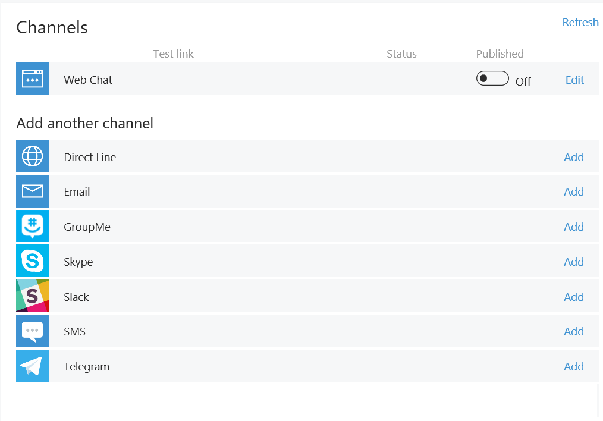
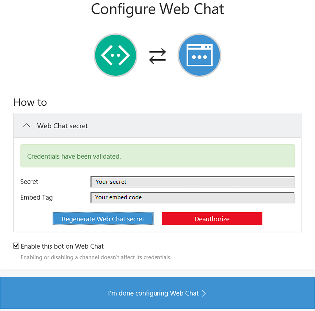
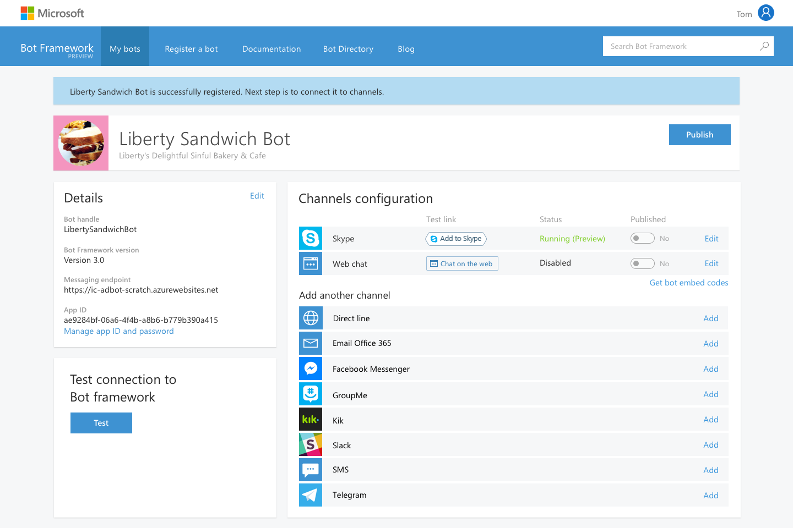
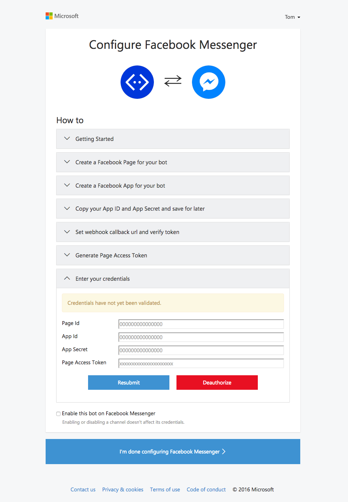

# Microsoft Bot Framework Demos #

<a name="Overview"></a>
## Overview ##
This is a set of demos showing how to interact with [Microsft Bot Framework](https://dev.botframework.com) creating your first bot.

<a id="goals" />
### Goals ###
In these demos, you will see how to:

1. [Create your first bot using Visual Studio and Bot Framework Template](#Demo1)
2. [Create a webapp on Azure to host your bot and how to deploy it.](#Demo2)
3. [Register your bot](#Demo3)
4. [Testing and publishing your bot](#Demo4)
5. [Embedding a webchat to a website](#Demo5)
6. [Connecting your bot to a channel - Facebook](#Demo6)

<a name="setup"></a>
### Setup and Configuration ###
Follow these steps to setup your environment for the demo.

1. Download the [Bot Builder SDK](https://github.com/Microsoft/BotBuilder/tree/master/CSharp)
2. Download the [template](http://aka.ms/bf-bc-vstemplate) for Visual Studio
3. Download the [Bot Framework Emulator](https://aka.ms/bf-bc-emulator) for _windows_ or [Bot Framework Emulator console](https://aka.ms/bfemulator) for Mac/Linux
    > **Note** Instructions on how to use the console app on Mac and Linux with Mono, click [here](https://docs.botframework.com/en-us/tools/bot-framework-emulator/#mac-and-linux-support-using-command-line-emulator)

<a name="Demo1"></a>
## Demo 1) Creating your first bot using Visual Studio ##

1. Open Visual Studio 2015
2. Create a new project choose Bot Framework Template and click on it.

> **Speaking Points:** Explain this project it is a WebAPI. It is build using ASP.NET.
>- Take time to explain the basic methods such as POST (receive message)
>- Also explain about libraries:
       
 * **POST** - The method receive a message from the channel where the client was sending messages
        * **Tip:** This method already cames with a countCaracters method and a response. Explore it with your audience.


<a name="Demo2"></a>
## Demo 2) Creating a webapp to host your bot

1. Browse to the [Azure Portal](https://portal.azure.com)

2. Click New / Web + Mobile / Web App.

3. Enter a unique name in the URL field and click the Create button. This will be the url of your bot.

    > **Speaking Points:** While the site is being created, explain that Azure is provisioning a new Web App for you with supporting services, monitoring, support for continuous deployment, etc.

    >- Note: This generally takes 30 - 60 seconds.

4. When the site comes up, scroll through the various features (Monitoring, Usage, Operations, Deployment, Networking) explaining that these are all live and have been provisioned with the Web App. You can click on the _settings_ option to bring up the _settings_ blade.

    > **Note**: If these tiles are not visible, you can add them by clicking on 'Add tiles' button and add Deployment, Operations, Usage etc.

5. Click on the Browse button. When the default landing page loads, point out that the page illustrates the different options for publishing to the new site, including Git, FTP, Visual Studio, etc.

6.  Back in the portal, Under 'General' option select 'Application settings'. Show that .NET, PHP, Python and Java are all show.


<a name="Demo3"></a>
## Demo 3) Registering your bot at Bot Framework Portal

1. Browse to the [Bot Framework Portal](https://dev.botframework.com/)

2. Click sign in at the top right

    > Note: If you already logged in, you can skip this step.

3. Log in with your LiveID (outlook, hotmail, live, msn, etc.)

4. Click in **Register a bot** to register a new bot

5. fill out all data about your bot.
    * **Name**: Displayed in Bot Directory. 35 character limit.
    * **Bot Handle**: Used in the URL for your bot. **Alphanumeric and underscore only**. Cannot be changed once registered.
    * **Description**: First 46 characters displayed on your bot card in Bot Directory. Full description displayed in bot details.

    * **Messaging endpoint**: HTTPS Rest endpoint that the bot implements to send and receive messages.
        - It will be your webapp previously created plus the route */api/messages/*
    * **Microsoft App ID**: Get your Microsoft App ID and password from the Microsoft Application registration portal. Paste the password in your bot configuration file.
        > **Note** - You have only one chance to see your Microsoft App Password. Save it in a safety place.

    * **Publisher name**: Your name or your company name
    * **Publisher Email**: Your Email or your commpany email
    * **Privacy statement**: If you have one, paste url here. If don't, you can use that -> http://go.microsoft.com/fwlink/?linkid=521839
    * **Terms of Use**: If you have one, paste url here. If don't, you can use tour website url
    * **Bot website**: Url of your bot previously created
    * **Hashtags**: Comma delimited.
    * **Languages**: ISO 639-1 format, comma delimited.
    * **Default Conversation Language**: The default language to use for new users.(in ISO 639-1 format)

6.  Accept Privacy statement, Terms of use, and Code of conduct. and click _Register_

<a name="Demo4"></a>
## Demo 4) Testing your bot

1. In your bot project at Visual Studio, run it.

    > **Note** - it will open a port 3978 or 3979.

2. Copy the Url

3. Open the Bot Framework Channel Emulator

4. At Bot url, paste the url that your previously copied.

5. Copy and paste the Microsoft App ID and Password

    > **Note** - If you have not registered your bot yet, just leave those fields blank.

6. The emulator url will be _http://localhost:9000/_.

    > **Note** - If you have problems here with Ngrok, just read [here](https://docs.botframework.com/en-us/tools/bot-framework-emulator/#navtitle) how to solve.

7. Now you can send messages to and receive from your bot.

8. In case that your publish your bot, just change the url of your bot.

> **Speaking Points:** Explain about publish and test the endpoint from Bot Framework Portal.


<a name="Demo5"></a>
## Demo 5) Using WebChat into your website or as your bot homepage

1. Go to [your bots](https://dev.botframework.com/#/bots)
2. Click on your bot
3. Look for “Web Chat” in the Channels section
    
4. Click on Edit for Web chat and press Generate Web Chat Secret
    
5. Copy the generated secret and embed tag and press “I’m done configuring Web Chat”
6. Replace _YOUR_SECRET_HERE_ with the embed secret from the same page.

> **Speaking Points:** Using this method you're exposing your bot secret. To do this more safety, generate a token:
    - Issue a server-to-server GET request to “https://webchat.botframework.com/api/tokens” and pass your web chat secret as the Authorization header.
    - The Authorization header uses the “BotConnector” scheme and includes your secret. (This auth scheme may also be used with a token but for now we’re using our secret to generate a token.) See example below.
    - The call will return a token good for one conversation. If you want to start a new conversation, you must generate a new token.
    - Change the “s=” parameter in your iframe embed to “t=”. The “t=” form works with tokens and automatically renews them before they expire.

```
<iframe src="https://webchat.botframework.com/embed/YOUR_BOT_ID?t=YOUR_TOKEN_HERE"></iframe>
```

7. Now, go back to your bot project at Visual Studio, and click **_default.htm_**
8. Delete all lines inside _body section_ and replace using your iframe webchat.

```
**Note**: you can style your bot using:

<iframe style="height:480px; width:402px" src="... SEE ABOVE ..."></iframe>
```

```
If you prefer, you can use this javascript to render fullscreen.


```


<a name="Demo6"></a>
## Demo 6) Connecting to Facebook Messenger

1. To configure a channel, go back to the [Bot Framework portal](https://www.botframework.com). Sign in, select your Bot, and go to the channels panel.
    
2. Pick the channel you wish to configure, and click add. You'll be taken to a page of instructions for registering a Bot. In the end in most cases you're configuring your credentials as a developer on the target service, registering your app, and getting a set of Oauth keys that Microsoft Bot Framework can use on your behalf.
    
3. Once you've gone through the steps here, return to the channel page on the dev portal, click the checkbox for the channel you chose (if you haven't already), and hit "save changes".
4. That's the end of configuration - your Bot is ready for your users. They will have their own steps to follow to give the Bot permission to participate in their group/channel or get connection details like the SMS phone number or e-mail. They can do this in the Bot Directory page for your Bot. The link to this is at the top of the Bot Details page in the dev portal.

> **Note"": You can follow those steps to add how many channels you want.